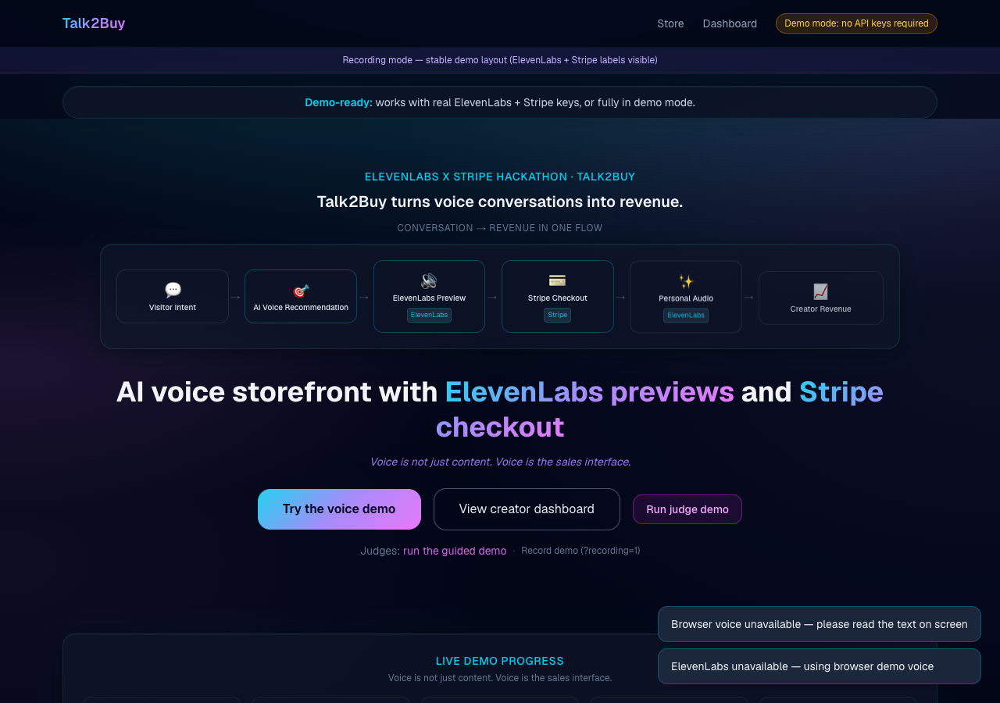
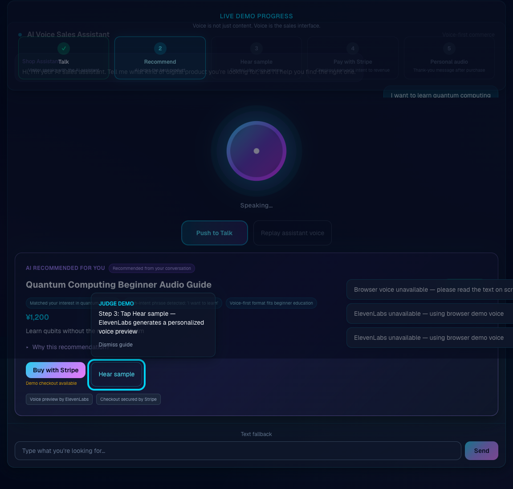
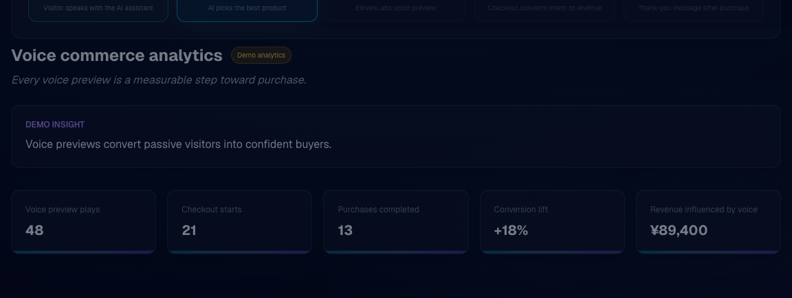
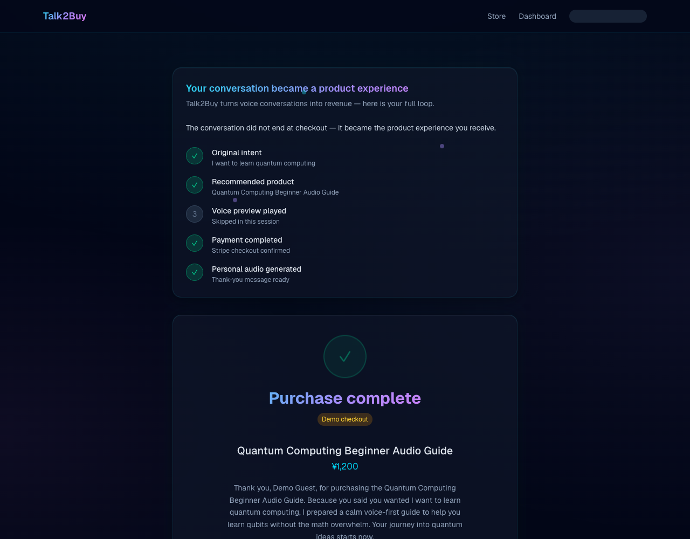
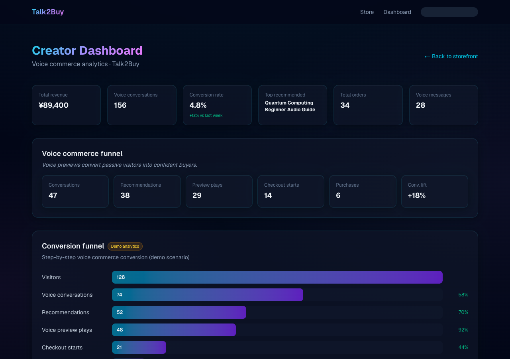

# Talk2Buy Storefront

Built with **ElevenLabs** · Powered by **Stripe** · **Demo mode** available

**Talk2Buy turns voice conversations into revenue.** Visitors talk with an AI sales assistant, hear personalized ElevenLabs previews, pay through Stripe, and receive spoken thank-you audio tied to their original intent.

**Voice is not just content. Voice is the sales interface.**

Built for the **ElevenLabs x Stripe** hackathon. Judges: see [HACKATHON_SUBMISSION.md](HACKATHON_SUBMISSION.md).

**Links:** [SUBMISSION_URLS.md](SUBMISSION_URLS.md) (live demo + video — update after deploy)

## Quick start

```bash
npm install
cp .env.example .env.local
npm run dev
```

Open [http://localhost:3000](http://localhost:3000). Header pill shows **Demo mode** or **Live mode** (ElevenLabs + Stripe keys).

| Mode | Requirements |
|------|----------------|
| Demo | No env keys — browser voice + demo checkout |
| Live | `STRIPE_SECRET_KEY`, `ELEVENLABS_API_KEY`, `ELEVENLABS_VOICE_ID`, `NEXT_PUBLIC_APP_URL` |

## Winning demo path (60–90s)

1. Hero — Conversation → Revenue pipeline (ElevenLabs + Stripe visible)
2. **Run judge demo** — overlay: Hear sample → Buy with Stripe
3. Match score + “Why this recommendation?”
4. Demo checkout → success **experience loop** + thank-you audio
5. Dashboard — funnel + voice commerce analytics

Recording tip: use [http://localhost:3000/?recording=1](http://localhost:3000/?recording=1) for a stable layout. Script: [DEMO_SCRIPT.md](DEMO_SCRIPT.md).

## Screenshots











## Deploy (Vercel)

1. Import [github.com/dorakingx/talk2buy-storefront](https://github.com/dorakingx/talk2buy-storefront)
2. Add variables from `.env.example`
3. Set `NEXT_PUBLIC_APP_URL` to `https://YOUR-APP.vercel.app`
4. Update [SUBMISSION_URLS.md](SUBMISSION_URLS.md) with your Vercel URL, then sync README / HACKATHON

## Pre-submission checklist

- [ ] App deployed; `NEXT_PUBLIC_APP_URL` set on Vercel
- [ ] GitHub repo public
- [ ] Demo mode works without keys
- [ ] Live mode tested if keys configured
- [ ] Demo video recorded (60–90s); link added to HACKATHON_SUBMISSION
- [ ] No `TBD` placeholders in final submission docs
- [ ] First 5 seconds show Talk2Buy, voice, ElevenLabs, Stripe, revenue

See [DEPLOYMENT_CHECKLIST.md](DEPLOYMENT_CHECKLIST.md) for full QA steps.

## Docs

| File | Purpose |
|------|---------|
| [HACKATHON_SUBMISSION.md](HACKATHON_SUBMISSION.md) | Judge-facing summary |
| [DEMO_SCRIPT.md](DEMO_SCRIPT.md) | Video script |
| [SUBMISSION_URLS.md](SUBMISSION_URLS.md) | Live demo + video links (single place to edit) |
| [DEPLOYMENT_CHECKLIST.md](DEPLOYMENT_CHECKLIST.md) | Lint, build, deploy, QA |

## License

MIT
