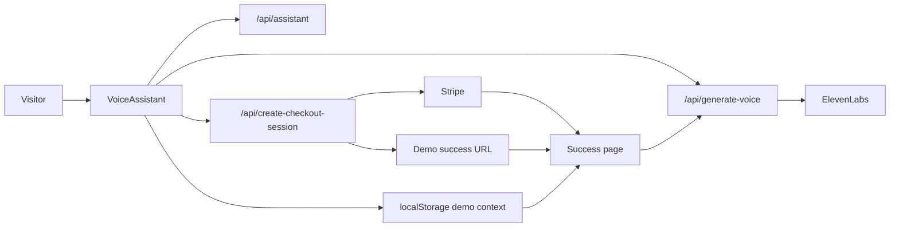

# Talk2Buy Storefront

**Voice is not just content. Voice is the sales interface.**

Talk2Buy is a voice-first commerce platform for digital creators. Visitors talk with an AI sales assistant, hear personalized ElevenLabs previews, pay through Stripe, and receive a spoken thank-you tied to their original intent.

Built for the **ElevenLabs x Stripe** hackathon.

## One-sentence pitch

Turn live conversations into product recommendations, voice previews, and instant Stripe checkout — without a static, impersonal storefront.

## Problem

Creators struggle to convert visitors into buyers. Static product pages do not explain fit personally, and text-only chatbots feel like support — not sales.

## Solution

An AI voice storefront where:

1. The visitor **talks** (push-to-talk or quick replies)
2. The assistant **recommends** with match score and structured reasons
3. **ElevenLabs** plays a personalized voice preview (not generic product copy)
4. **Stripe** completes the purchase
5. A **personalized thank-you audio** closes the loop using conversation context

## How ElevenLabs is used

- Assistant replies spoken after each recommendation
- **Hear sample** generates a short preview from the visitor's intent + product fit
- Post-purchase thank-you message via `/api/generate-voice`
- Demo mode: browser SpeechSynthesis fallback with clear labeling

## How Stripe is used

- Stripe Checkout for real payments when `STRIPE_SECRET_KEY` is set
- Metadata stores `productId`, `customerName`, and `userIntent`
- **Demo checkout** when Stripe is not configured (client + API both return a success URL)

## Demo flow (watch the live progress bar)

| Step | What happens |
|------|----------------|
| Talk | User sends a message |
| Recommend | AI returns product + match |
| Hear sample | Personalized ElevenLabs preview |
| Pay with Stripe | Checkout or demo redirect |
| Personal audio | Thank-you on success page |

**Judge tip:** Click **Run 30-sec demo** on the hero for an automated walkthrough.

## Quick start

```bash
npm install
cp .env.example .env.local
npm run dev
```

Open [http://localhost:3000](http://localhost:3000).

### Demo mode (no API keys)

The app works out of the box:

- Rule-based assistant + quick replies
- Browser voice for previews and thank-you
- Demo checkout → success page with personalized copy from `localStorage` context

### Live mode

| Variable | Purpose |
|----------|---------|
| `NEXT_PUBLIC_APP_URL` | Stripe redirect URLs |
| `STRIPE_SECRET_KEY` | Real Stripe Checkout |
| `ELEVENLABS_API_KEY` | ElevenLabs TTS |
| `ELEVENLABS_VOICE_ID` | Voice ID from ElevenLabs library |
| `OPENAI_API_KEY` | Optional GPT assistant replies |

## Architecture



## Project structure

```
src/
  app/           # Pages + API routes
  components/    # VoiceOrb, VoiceAssistant, RecommendationCard, etc.
  hooks/         # useDemoFlow
  lib/           # products, assistant, voice-scripts, demo-storage, voice-client
  types/
```

## Scripts

| Command | Description |
|---------|-------------|
| `npm run dev` | Development server |
| `npm run build` | Production build |
| `npm run lint` | ESLint |

## Demo video

See [DEMO_SCRIPT.md](DEMO_SCRIPT.md) for a 60–90 second recording script.

## Deploy (Vercel)

1. Import the GitHub repo
2. Add environment variables from `.env.example`
3. Set `NEXT_PUBLIC_APP_URL` to your production domain

## License

MIT
